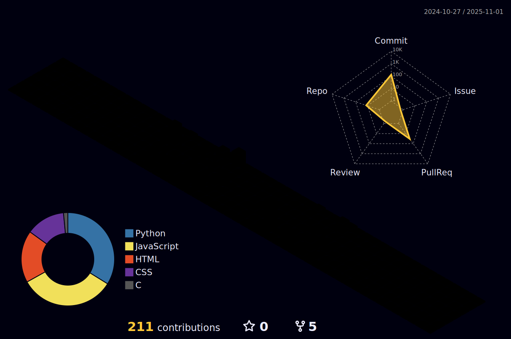

<div align="center">
  
</div>


# Sahil Shaw

```typescript
const profile = {
  name: "Sahil Shaw",
  bio: "I'm Sahil Shaw, a B.Tech student in Information Technology at Techno Main Saltlake, Kolkata (2022–2026). I'm passionate about full-stack web development, modern JavaScript frameworks, and building impactful user-centric projects. I enjoy working on innovative solutions, demonstrated through hackathon-winning platforms like Saarthi and College Club Management.",
  currentWork: "Currently, I'm focused on building scalable, responsive web applications using React.js, JavaScript, and CSS. I recently developed:

Saarthi – a mentorship platform with WebRTC-based video calls and session tracking.

Movie Dunia – a movie discovery app using OMDB/TMDB APIs.

Also contributing to open-source and constantly improving my problem-solving skills through platforms like LeetCode and GitHub.",
  skills: [
    "React",
    "Tailwind",
    "Bootstrap",
    "HTML5",
    "Material UI",
    "CSS3",
    "Node.js",
    "MongoDB",
    "Docker",
    "React Native",
    "JavaScript",
    "Java",
    "C++",
    "C"
  ],
}
```

## 🔭 I'm currently working on

Currently, I'm focused on building scalable, responsive web applications using React.js, JavaScript, and CSS. I recently developed:

Saarthi – a mentorship platform with WebRTC-based video calls and session tracking.

Movie Dunia – a movie discovery app using OMDB/TMDB APIs.

Also contributing to open-source and constantly improving my problem-solving skills through platforms like LeetCode and GitHub.

## 👀 Visitor Count

<!-- ⚠️ Important: Replace 'SahilShaw2004' with your actual GitHub username in the URL below -->
<p align="center">
  
  <br>Thank you for visiting my profile! Come back soon!
</p>

## 🏆 GitHub Trophies

<!-- ⚠️ Important: Replace 'SahilShaw2004' with your actual GitHub username in the URL below -->
<p align="center">
  
</p>

## 📊 GitHub Stats

<!-- ⚠️ Important: Replace 'SahilShaw2004' with your actual GitHub username in the URL below -->
<div align="center">
  
</div>

## 🔝 Most Used Languages

<!-- ⚠️ Important: Replace 'SahilShaw2004' with your actual GitHub username in the URL below -->
<div align="center">
  
</div>

## 🔥 Contribution Streak

<!-- ⚠️ Important: Replace 'SahilShaw2004' with your actual GitHub username in the URL below -->
<div align="center">
  
</div>
# ♟️ Sahil's Community Chess Tournament

**It's White's turn! Click a move below to participate.**

---

## 📋 Board
<!-- CHESS_BOARD_START -->
**Current Turn:** `White`

## ♟️ Current Board:

|   | A | B | C | D | E | F | G | H |
|---|---|---|---|---|---|---|---|---|
| 8 | ♜ |   | ♝ | ♛ | ♚ | ♝ | ♞ | ♜ |
| 7 | ♟ | ♟ | ♟ | ♟ | ♟ | ♟ | ♟ | ♟ |
| 6 |   |   | ♞ |   |   |   |   |   |
| 5 |   |   |   |   |   |   |   |   |
| 4 |   |   |   |   | ♙ |   |   |   |
| 3 |   |   |   |   |   |   |   |   |
| 2 | ♙ | ♙ | ♙ | ♙ |   | ♙ | ♙ | ♙ |
| 1 | ♖ | ♘ | ♗ | ♕ | ♔ | ♗ | ♘ | ♖ |

<!-- CHESS_BOARD_END -->


---
## 📝 How to Make a Move

Anyone can play — just follow the rules below and open a pull request!

### ✅ Format:
> Your move must be in **this format**:  
> `E2 to E4` *(case-insensitive, one move only)*

### 🔁 Rules:
- You must **only change `game.json`**
- Make **only one piece move** in the board array
- Switch `"turn"` to the other player (`white` → `black`, or vice versa)
- Don't touch `README.md` (it updates automatically)

---

### ⚠️ Invalid PRs will be closed if:
- More than one piece was moved
- It's not your turn
- The move format is incorrect
## 💻 Tech Stack

```json
{
  "frontend": [
    "React",
    "Tailwind",
    "Bootstrap",
    "HTML5",
    "Material UI",
    "CSS3"
  ],
  "backend": [
    "Node.js",
    "MongoDB"
  ],
  "devops": [
    "Docker"
  ],
  "mobile": [
    "React Native"
  ],
  "languages": [
    "JavaScript",
    "Java",
    "C++",
    "C"
  ]
}
```

## 🌐 Socials

```javascript
const socials = {
  github: "SahilShaw2004",
  linkedin: "http://linkedin.com/in/sahil-shaw-262b19250/",
  twitter: "SahilSh64025258",
  leetcode: "https://leetcode.com/u/Sahil_Shaw_2004/",
}
```

<div>
<a href="https://github.com/SahilShaw2004"></a> <a href="http://linkedin.com/in/sahil-shaw-262b19250/"></a> <a href="https://x.com/SahilSh64025258"></a> <a href="https://leetcode.com/u/Sahil_Shaw_2004/"></a> 
</div>
<h2 align="center">📊 My 3D GitHub Contributions</h2>
<p align="center">
  
</p>
<p align="center">
  
</p>

## 👥 Contributors

<a href="https://github.com/SahilShaw2004/SahilShaw2004/graphs/contributors">
  
</a>

## 📫 How to reach me

```javascript
const contact = {
  email: "shawsahil488@gmail.com",
  phone: "+918100374419",
}
```
[](https://holopin.io/@sahilshaw2004)
```typescript
// Thanks for visiting my profile!
console.log("Let's connect and collaborate on exciting projects!");

process.exit(0); // Until next time 👋
```
